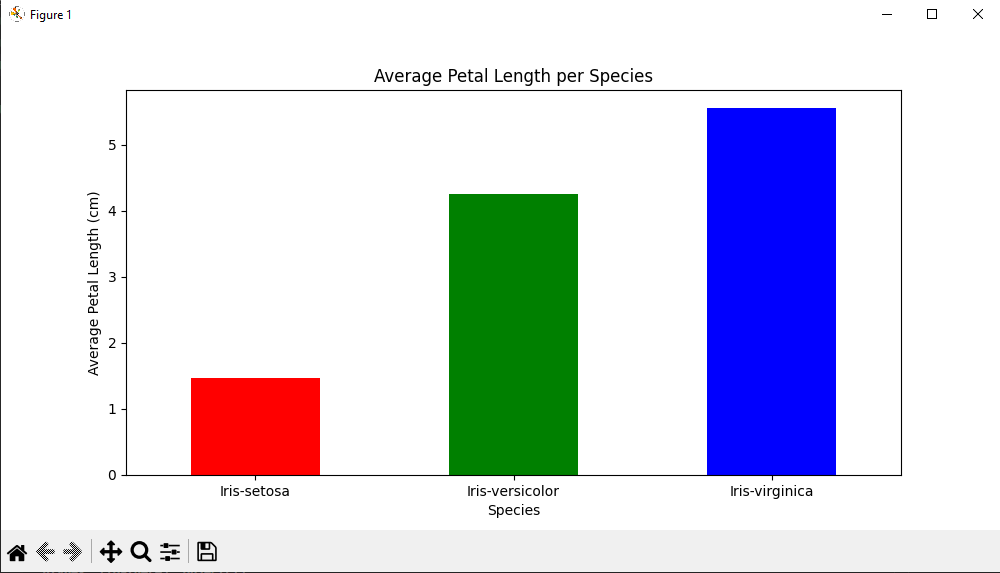
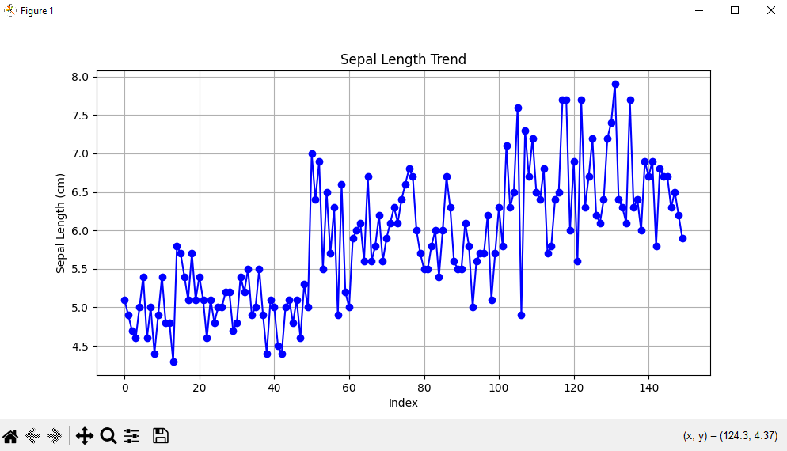
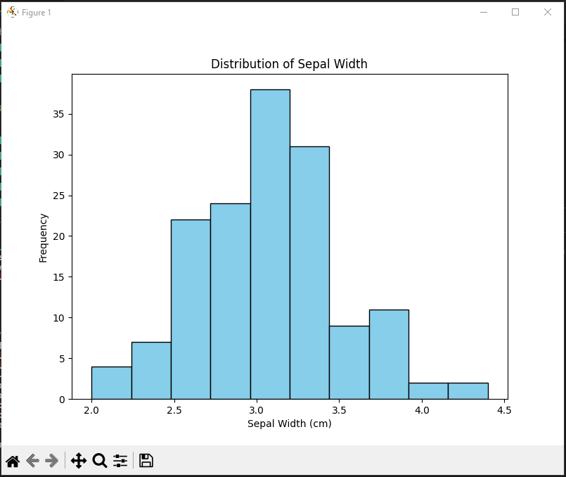
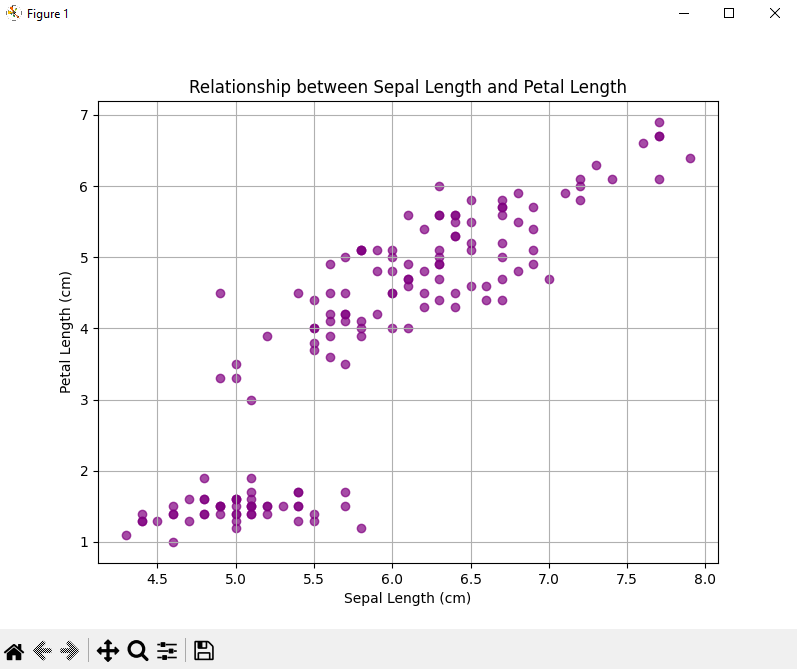

# WK-7-python-data-analysis

- Assignment by PLP on data analysis using pandas and matplotlib

## What the project entails
 - Using the **Free Iris DataBase** I was able to analyze the data and create a bargraph, histogram, line-graph, scatter chart.
 - This project provides a guide to setting up a Python environment for data analysis and creating basic visualizations using the   Pandas and Matplotlib libraries. 

 <div class="outputs">
    <div class = output-box>
        <h4> BarChart</h4>
        
    </div>
     <div class = output-box>
        <h4> Project</h4>
        
    </div>
     <div class = output-box>
        <h4> Histogram</h4>
        
    </div>
     <div class = output-box>
        <h4> Scatter Graph</h4>
        
    </div>
    
 </div>

 <style>
    .outputs{
        display:grid;
        grid-template-columns:1fr 1fr;
        gap:1rem;
    }
    .output-box img{
        border-radius:15px;
    }
 </style>

 ## How to setup this project on your machine

 ### Prerequisites

- Before you begin, ensure you have the following installed:

Python: Download from  https://www.python.org/downloads/.  Make sure to add Python to your PATH during installation.

### Project Setup

#### Verify Python Installation:

   - Open a VS Code terminal.

   - Check the Python version:  

```bash 
python --version
``` 
or 

```bash 
python3 --version
``` 

#### Install the Python Extension for VS Code:

- Open VS Code.

- Install the Microsoft Python extension.

#### Verify Pandas and Matplotlib Installation:

In the VS Code terminal, check if Pandas and Matplotlib are installed:
```bash
    pip show pandas
    
    pip show matplotlib
```

If they are not installed, install them: 

```bash
    pip install pandas matplotlib
```